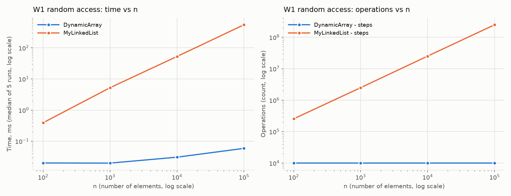
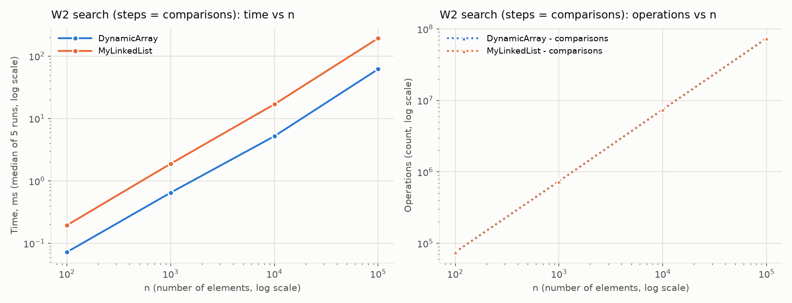
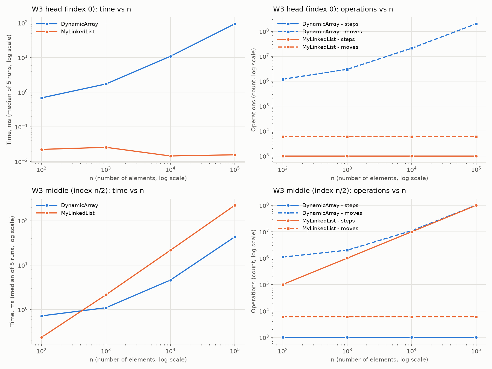
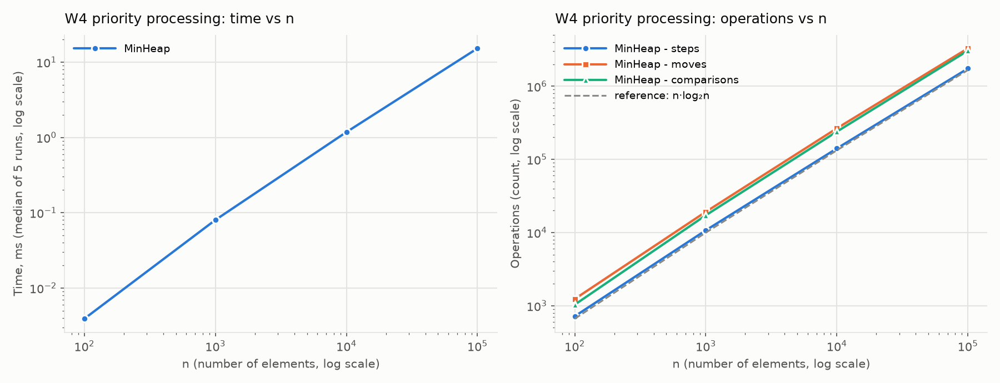
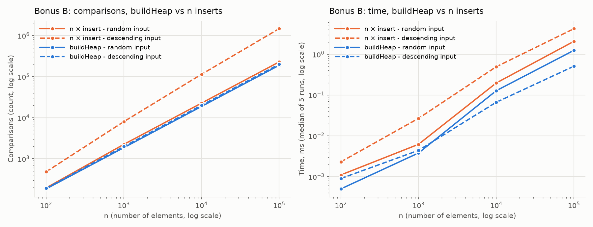

# Report - Assignment 2: Data Structures

Nurlan Yusupov, SE-2526

## 1. Complexity

| Structure | Operation | Best | Average | Worst | Aux. space | Justification |
|---|---|---|---|---|---|---|
| DynamicArray | `add(x)` | Θ(1) | Θ(1) amortized | Θ(n) | Θ(1), Θ(n) on resize | Resize copies n elements, but doubling keeps total copies < 2n. |
| DynamicArray | `add(index, x)` | Θ(1) | Θ(n) | Θ(n) | Θ(1) | Shifts `size - index` elements; best at `index = size`. |
| DynamicArray | `remove(index)` | Θ(1) | Θ(n) | Θ(n) | Θ(1) | Shifts `size - index - 1` elements; best at the last index. |
| DynamicArray | `get(index)` | Θ(1) | Θ(1) | Θ(1) | Θ(1) | One cell read by address. |
| DynamicArray | `contains(x)` | Θ(1) | Θ(n) | Θ(n) | Θ(1) | Linear scan; worst when `x` is absent. |
| MyLinkedList | `add(x)` | Θ(1) | Θ(1) | Θ(1) | Θ(1) | Linked after `tail`. |
| MyLinkedList | `add(index, x)` | Θ(1) | Θ(n) | Θ(n) | Θ(1) | Walk from the nearer end (≤ n/2 nodes), then 4 link updates. |
| MyLinkedList | `remove(index)` | Θ(1) | Θ(n) | Θ(n) | Θ(1) | Same walk, then 2 link updates; best at either end. |
| MyLinkedList | `get(index)` | Θ(1) | Θ(n) | Θ(n) | Θ(1) | Walk of `min(index, n - index)` nodes. |
| MyLinkedList | `contains(x)` | Θ(1) | Θ(n) | Θ(n) | Θ(1) | Linear scan from `head`. |
| MinHeap | `insert(x)` | Θ(1) | O(1) on random keys | Θ(log n) | Θ(1), Θ(n) on resize | Bubble-up climbs at most the height ⌊log₂ n⌋. |
| MinHeap | `peekMin()` | Θ(1) | Θ(1) | Θ(1) | Θ(1) | Minimum is at index 0. |
| MinHeap | `extractMin()` | Θ(1) | Θ(log n) | Θ(log n) | Θ(1) | Last element moves to the root and sinks; best when all keys are equal. |

Total space: Θ(n) for all three. Arrays use 4 B per element (capacity ≤ 2n); a list node takes
about 24 B (object header, `int`, two references).

## 2. Loop invariants

### 2.1 `DynamicArray.contains(x)`

```java
for (int i = 0; i < size; i++) {
    if (data[i] == x) return true;
}
return false;
```

- **Invariant:** before iteration `i`, none of `data[0..i-1]` equals `x`.
- **Initialization:** for `i = 0` the range is empty, so it holds.
- **Maintenance:** if `data[i] == x` the method returns `true` correctly; otherwise none of
  `data[0..i]` equals `x`, which is the invariant for `i + 1`.
- **Termination:** the loop ends at `i = size`; then no element of `data[0..size-1]` equals `x`,
  so `false` is correct.
- **Conclusion:** `true` is returned only when `x` is found and `false` only after all elements
  were checked, so `contains` is correct.

### 2.2 `DynamicArray.remove(index)` - shift loop

```java
int removed = data[index];
for (int j = index; j < size - 1; j++) {
    data[j] = data[j + 1];
}
size--;
```

Let `A` and `s` be the contents and size before the call.

- **Invariant:** before iteration `j`, `data[0..index-1] = A[0..index-1]`,
  `data[index..j-1] = A[index+1..j]` and `data[j..s-1] = A[j..s-1]`.
- **Initialization:** for `j = index` the shifted part is empty and nothing has been written.
- **Maintenance:** `data[j+1]` is still untouched, so `data[j] = data[j+1]` stores `A[j+1]`; the
  shifted part grows by one cell and the untouched part shrinks by one.
- **Termination:** the loop ends at `j = s - 1`; then `data[index..s-2] = A[index+1..s-1]`, and
  after `size--` the array is `A` without `A[index]`.
- **Conclusion:** exactly the element at `index` is removed and the others keep their order, so
  `remove` is correct.

## 3. Plots









## 4. Discussion

DynamicArray answers `get(i)` in one step, while MyLinkedList walks about n/4 nodes on average,
so in W1 the list is slower by four orders of magnitude. In W2 both structures do exactly the
same number of steps and comparisons, yet the list is about 3 times slower. The reason is
spatial locality: one 64-byte cache line holds 16 consecutive `int` values, and the hardware
prefetcher loads the next lines of an array in advance. In the list the address of the next
node is known only after the current node is loaded, so this pointer chasing makes every step
wait for memory and prevents the CPU from overlapping loads. Each node is also a separate object
of about 24 B instead of 4 B, so fewer useful values fit in the cache, and millions of small
objects give the garbage collector extra work. Locality matters even for the array: at
n = 100 000 its 400 KB no longer fit in the L1/L2 cache, so even its Θ(1) `get` becomes slightly
slower. The same effect explains W3-middle: both
structures do about 10⁸ basic operations, but the array's contiguous shifts are about 5 times
faster than the list's walk. In W3-head the list needs only 6 link updates per insert/remove pair
for any n, while the array shifts all n elements, so the list wins by thousands of times.
MyLinkedList is the better choice when elements are added and removed at the ends or at a known
position, for example in a queue, deque or LRU cache. MinHeap is the better choice when the
program repeatedly needs the minimum, as in a task scheduler, Dijkstra's algorithm or top-k
selection, because `peekMin` is Θ(1) and `insert`/`extractMin` are Θ(log n).

## 5. Bonus B - buildHeap



| n = 100 000 | n × `insert`, comparisons | `buildHeap`, comparisons |
|---|---|---|
| random input | 227 662 | 188 424 |
| descending input | 1 468 946 | 199 978 |

`buildHeap` calls `siftDown` from `n/2 - 1` down to `0`; half of the nodes are leaves and only a
few nodes near the root sink `log n` levels, so the total work is below 2n, i.e. Θ(n). On
descending input every insert climbs to the root, giving Θ(n log n): about 7 times more
comparisons and several times more time. On random input a new key climbs only about one level on average, so the
two methods are close.